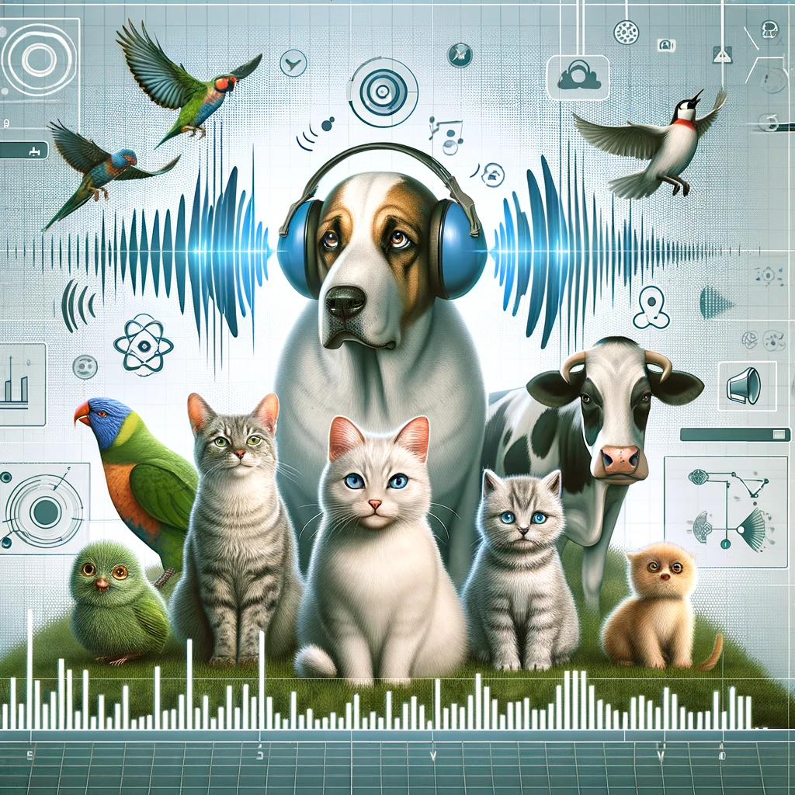

# Animal Sound Classification

This project focuses on the classification of animal sounds using deep learning. The core idea is to utilize audio processing techniques and a fine-tuned version of the hubert-base-ls960 model to accurately classify different animal sounds. This application could serve various purposes, from ecological monitoring to educational software.

The dataset used for training is a subset of the ESC-50 dataset, specifically filtered to include only animal sound categories such as dog, cat, rooster, and more. This filtered dataset allows for a more focused approach to animal sound classification.


<p align="center">

</p>

## Project Structure

- `data_preprocessing.py`: This script is used for preprocessing the audio data from the ESC-50 dataset. It filters out the required animal sounds and prepares them for training.
- `train_model.py`: This script contains the code for training the classification model using the preprocessed data.
- `README.md`: Provides an overview of the project, installation instructions, and how to run the scripts.
- `requirements.txt`: Lists all the necessary Python packages required to run the project.

## Installation

To set up this project, follow these steps:

1. Clone the repository:
   ```bash
   git clone https://github.com/rawbeen248/audio_classification_finetuning
   ```

2. Navigate to the project directory:
    ```bash
    cd Audio_Classification_Finetuning
    ```


3. Install the required packages:
   ```bash
   pip install -r requirements.txt
   ```

## Usage 

First, run the data preprocessing script to prepare your dataset:
   ```bash
   python data_preprocessing.py
   ```

Then, you can train the model by running:
   ```bash
   python train_model.py
   ```

## Hugging Face Model
The fine-tuned model is available on Hugging Face and can be accessed through the following link:
[Animal Sound Classification](https://huggingface.co/ardneebwar/wav2vec2-animal-sounds-finetuned-hubert-finetuned-animals)

You can use this model directly from Hugging Face Model Hub for audio classification tasks involving the identified animal sounds. 
